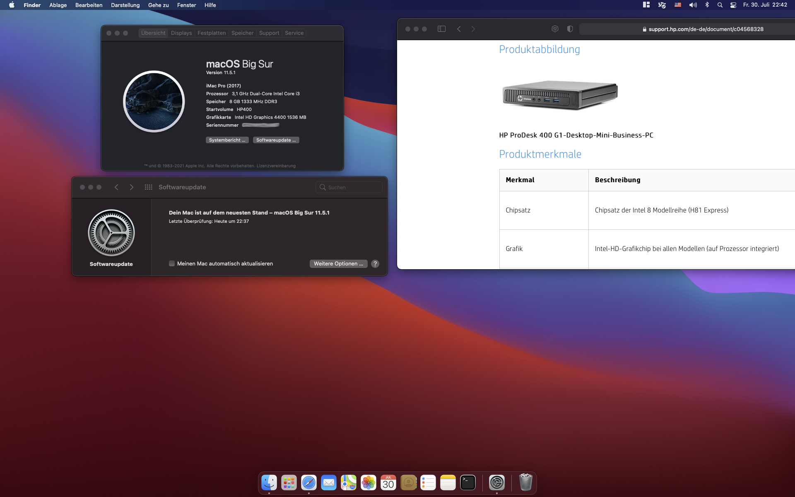

# OpenCore EFI for HP Prodesk 400 G1 Desktop Mini Business PC

(testet with BigSur 10.5.1)

details:
* iMac Pro (2017) smbios, **serials removed** 
* OpenCore 7.1
* Lilu 1.5.4
* USBInjectAll 0.7.6
* VirtualSMC 1.2.5
* WhateverGreen 1.5.1
* AppleALC 1.6.2
* IntelMausi 1.0.7

## Configuration

| Specifications | Details                                  |
| ------------------- | ----------------------------------- |
| Computer model      | HP Prodesk 400 G1 DM       					|
| Processor           | Intel i3-4160T Processor    		    |
| Graphics            | Intel HD4400                        |
| Sound               | Realtek ALC221                      |
| Ethernet		        | Intel  i217LM-GbE-LOM            		|

not tested:
* VGA out
* m2 slots

Screen resolution problem:
* Dell 2405 works with full resolution of 1920x1200 (and also with lower resolutions)
* AOC Q3279VWF only works with 1080p but monitor has 2560x1440, currently no idea why, the iGPU HD4400 could do it 

### First-time installation
- follow [dortania guide](https://dortania.github.io/OpenCore-Install-Guide/installer-guide/winblows-install.html#downloading-macos) to create macrecovery usb stick 
- use this EFI-folder on that usb stick
- create macserials (see dortania guide) and add them to config.plist
- UEFI-start that usb-stick via boot manager
- erase target disk via disk utilities
- install MacOS (needs network attached)
- wait, it needs some restarts before ready
- **ready!**

